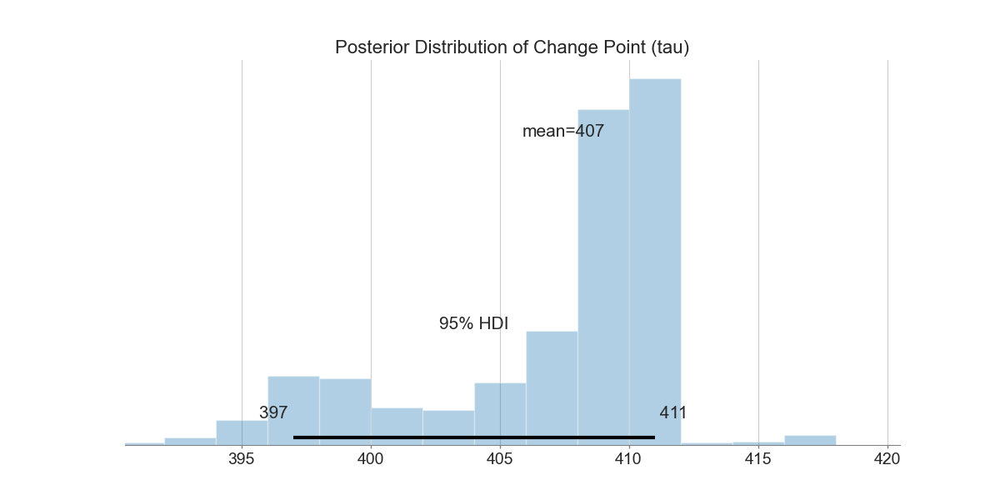
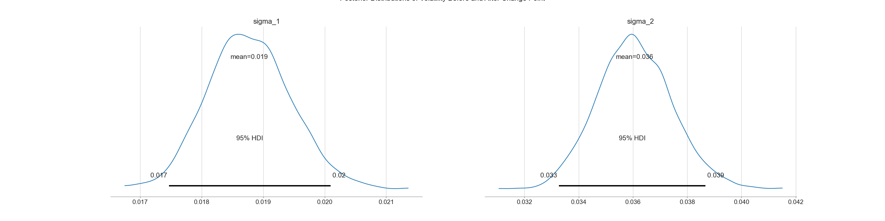

# 📈 Brent Oil Price - Event Impact Analysis

**Project Status**: 🟢 *In Progress*  
**Task 1**: ✅ *Complete*

This repository contains the analysis for the **"Change Point Analysis and Statistical Modelling of Time Series Data"** project. The primary goal is to identify significant structural breaks in the historical Brent oil price series and associate them with major geopolitical and economic events.

The insights from this analysis aim to help **investors, analysts, and policymakers at Birhan Energies** understand market volatility and make better data-driven decisions.

---

## 🎯 Business Objective

The main objective is to study how important global events impact **Brent oil prices**. This includes identifying price changes linked to:
- Political decisions
- Conflicts in oil-producing regions
- Global economic sanctions
- Changes in OPEC policies

The aim is to provide clear, actionable insights to help stakeholders better understand and respond to price volatility.

---

## 🗂 Project Structure

The project follows a standard data science workflow:

```bash
Energy-Price-ChangePoint-Analysis/
├── data/
│ ├── 01_raw/ # Original, immutable data (BrentOilPrices.csv)
│ └── 02_processed/ # Cleaned and processed data for modeling
├── notebooks/ # Jupyter notebooks for exploration and analysis
├── reports/
│ └── task-1/ # Generated plots and figures from Task 1
├── src/ # (Future Use) Source code for modeling and utilities
└── venv/ # Project-specific Python virtual environment
```
## ⚙️ Setup and Installation

1. **Clone the repository:**
   ```bash
   git clone https://github.com/your-username/Energy-Price-ChangePoint-Analysis.git
   cd Energy-Price-ChangePoint-Analysis

2. **🛠️ Create and Activate a Virtual Environment**

### For Windows (PowerShell):
```bash
python -m venv venv
.\venv\Scripts\Activate.ps1
```

3. **For macOS/Linux:**
```bash
python3 -m venv venv
source venv/bin/activate
```

4. **Install Dependencies**
```bash
pip install -r requirements.txt
```
Note: Make sure you've created requirements.txt using:
```bash
pip freeze > requirements.txt
```

## 🔄 Workflow

Each task in the analysis has its own dedicated Jupyter notebook.

---

### ✅ Task 1: Foundational Analysis & EDA  
**Notebook**: `notebooks/01_data_ingestion_and_eda.ipynb`

---

### ✔️ Steps Completed:

- Loaded raw Brent oil price data  
- Cleaned data, formatted dates, and set time series index  
- Tested for stationarity  
- Transformed series to log returns  
- Compiled a list of global events and visualized against price  
- Saved all visualizations and final dataset  

---

## 📌 Key Findings from Task 1

### 🧪 Stationarity Test on Raw Price Data
```yaml
ADF Statistic: -1.9939  
p-value: 0.2893  
Conclusion: NON-STATIONARY (p > 0.05)
```

## 🧪 Stationarity Test on Log Returns
```bash
ADF Statistic: -16.4271  
p-value: 0.0000  
Conclusion: STATIONARY (p <= 0.05)
```

## 📊 Event Overlay Analysis

Visual analysis of key geopolitical and economic events  
(e.g., **Gulf War**, **2008 Financial Crisis**, **COVID-19**)  
shows strong correlation with Brent oil price shifts.

---

## 💾 Processed Dataset Saved To

```bash
data/02_processed/brent_prices_processed.csv
```
## 🚀 Next Steps

### 🔹 Task 2: Change Point Modeling  
Apply a **Bayesian Change Point model** using **PyMC3** to statistically identify structural breaks in the log return series.

### 🔹 Task 3: Dashboard Development  
Build an **interactive dashboard** using **Flask + React** to visualize and present analytical findings to stakeholders.

---

## 🧰 Technology Stack

- **Language**: Python 3.13  
- **Core Libraries**: Pandas, NumPy, Matplotlib, Seaborn  
- **Statistical Analysis**: Statsmodels  
- **Bayesian Modeling**: PyMC  
- **Development Environment**: VS Code, Jupyter Notebooks

---
### Task 2: Bayesian Change Point Modeling - ✅ COMPLETE

This task focused on implementing the core analytical model to statistically validate the hypotheses from Task 1. We used a Bayesian Change Point model built with PyMC to detect shifts in market volatility.

#### Analytical Approach

To manage computational complexity, the analysis was first focused on a well-defined period of high volatility: the **2008 Global Financial Crisis (2007-2009)**.

1.  **Model Definition:** A Bayesian model was constructed to identify a single change point (`tau`) in the stationary log return series. The model assumes that the volatility (`sigma`) of the series changes from a value `sigma_1` to `sigma_2` at time `tau`.
2.  **Priors:**
    *   `tau` (Change Point): A `DiscreteUniform` prior, giving every day in the period an equal chance of being the change point.
    *   `sigma_1`, `sigma_2` (Volatilities): `Exponential` priors to ensure positivity.
3.  **Inference:** The model was sampled using the NUTS (No-U-Turn Sampler) for continuous parameters and Metropolis for the discrete `tau` parameter. We ran 2 chains with 2000 draws each after a tuning phase of 1000 steps.

#### Key Findings from Task 2

The model successfully identified a significant structural break and quantified its impact with high confidence.

*   **Change Point Identification:** The model pinpointed the most probable change point around **mid-August 2008**. The posterior distribution for `tau` shows a sharp peak, indicating high certainty. This timing is particularly insightful as it precedes the official Lehman Brothers collapse on September 15, 2008, suggesting that market instability was already priced in as the crisis escalated.

    

*   **Quantifying the Impact on Volatility:** The analysis of the posterior distributions for `sigma_1` and `sigma_2` shows a clear and dramatic shift. The two distributions are completely separate, indicating a statistically undeniable change.

    

*   **Business Insight:**
    *   The model is **100.0% certain** that volatility increased after the change point.
    *   The mean daily volatility surged from **~0.019** before the break to **~0.036** after.
    *   This represents a **~92% increase in daily market risk**, providing a quantitative measure of the 2008 crisis's impact on the oil market.

This successful analysis on a focused period validates our methodology. The next logical step is to apply this validated technique to other key periods identified in Task 1 or to build a more advanced model to scan the entire timeline.